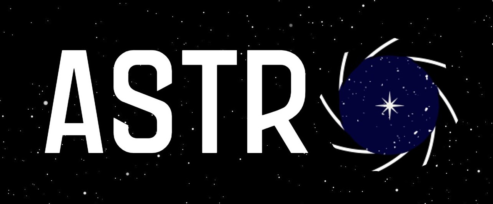
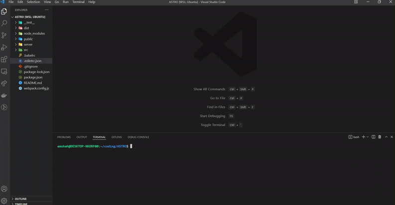
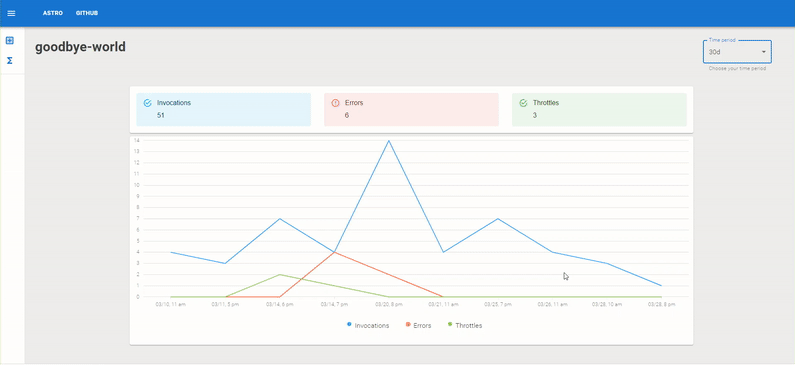

<!-- PROJECT LOGO -->
<br />
<div align="center">
    
    <h1>AWS Lambda Metrics Monitoring Tool</h1>

<!-- PROJECT SHIELDS -->

[![Contributors][contributors-shield]][contributors-url]
[![Forks][forks-shield]][forks-url]
[![Stargazers][stars-shield]][stars-url]
[![Issues][issues-shield]][issues-url]
[![MIT License][license-shield]][license-url]

</div>

<!-- TABLE OF CONTENTS -->

<details open="open">
  <summary>Table of Contents</summary>
  <ol>
    <li><a href="#about-astro">About Astro</a></li> 
    <li><a href="#tech-stack">Tech Stack</a></li>      
    <ul>
      <li><a href="#getting-started">Getting Started</a></li>      
      <li><a href="#lambda-metrics">Lambda Metrics</a></li>   
    </ul>
    <ul>
      <li><a href="#contributing">Contributing</a></li>     
    </ul>
    <li><a href="#license">License</a></li>
    <li><a href="#contributors">Authors</a></li>
  </ol>
</details>

<!-- ABOUT -->

## About Astro

Serverless architecture is an exciting mainstay of cloud computing. Amazon's Web Services (AWS) Lambda is a giant in the serverless space and is widely utilized by various companies. Its event-driven paradigm to building distributed, on-demand infrastructure is also cost-effective since Lambda functions are billed only when they are executed. This reduces the physical need for servers, eliminating expensive hosting costs just to keep a server running even if it’s not in use. One issue is that navigating through the AWS console can be daunting and frustrating. Specifically, to measure a user's lambda functions, there are too many options and this massive flexibility proves cumbersome when one only needs to visualize specific metrics at a glance.

As a way to solve this, we built Astro: a free, open-source lambda function monitoring tool that users can connect to their AWS account to securely and easily monitor and track key metrics.

<p align="right">(<a href="#top">back to top</a>)</p>

### Tech Stack

- [Redux Toolkit](https://redux-toolkit.js.org/)
- [React](https://reactjs.org/)
- [Material-UI](https://material-ui.com)
- [Node](https://nodejs.org/en/)
- [Express](https://expressjs.com)
- [PostgreSQL](https://postgresql.org)
- [AWS SDK](https://aws.amazon.com/sdk-for-javascript/)
- [AWS CloudFormation](https://aws.amazon.com/cloudformation/)
- [AWS STS](https://docs.aws.amazon.com/STS/latest/APIReference/welcome.html)
- [Jest](https://jestjs.io/)
- [Supertest](https://www.npmjs.com/package/supertest)
- [React Testing Library](https://testing-library.com/docs/react-testing-library/intro/)

<p align="right">(<a href="#top">back to top</a>)</p>

<!-- GETTING STARTED -->

## Getting Started

If you are a developer trying to add/improve functionality, you can skip step 4 and go to step 5. If you are an AWS end user, do not worry about step 5.

1. Fork and clone the forked repo

```sh
 git clone <your-forked-repo>
 cd Astro
```

2. Install package devDependencies

```sh
 npm install
```

3. If you are an AWS End User then use the following command to build the application and the necessary .env template file, which you should fill in with your AWS credentials (region, security key id, and access key id).

<div align="center">
    
    <br><br>
</div>

```sh
npm run build
```

4. Afterwards, you can run Astro by using the following command and then navigating to localhost:1111 in your browser

```sh
npm run start
```

5. If you are a developer trying to add/improve functionality, instead of step 4 you should use the following command to run Astro in development and navigate to localhost:8080 in your browser to take advantage of hot module reloading.

```sh
npm run dev
```

### Lambda Metrics

The key AWS Lambda function metrics we focused on are: throttles, invocations, and errors. One can see their total metric values in Account Totals. To see metrics by function, click the Functions tab to see a list of your lambda functions and the associated metrics for each function. Within the function tab, users can visualize their metrics over a specific time period using the drop down menu. This will also update the account total metrics in the account total tab.

<div align="center">
    
    <br><br>
</div>

<p align="right">(<a href="#top">back to top</a>)</p>

<!-- CONTRIBUTING -->

## Contributing

Contributions are what make the open source community such an amazing place to learn, inspire, and create. Any contributions you make are **greatly appreciated**.

If you have a suggestion that would make this better, please fork the repo and create a pull request. You can also simply open an issue with the tag "enhancement".
Don't forget to give the project a star! Thanks again!

1. Fork the Project
2. Create your Feature Branch (`git checkout -b feature/AmazingFeature`)
3. Commit your Changes (`git commit -m 'Add some AmazingFeature'`)
4. Push to the Branch (`git push origin feature/AmazingFeature`)
5. Open a Pull Request

<p align="right">(<a href="#top">back to top</a>)</p>

<!-- LICENSE -->

## License

Distributed under the MIT License. See `LICENSE` for more information.

<p align="right">(<a href="#top">back to top</a>)</p>

<!-- CONTACT -->

## Contributors

- Adam White [Github](https://github.com/adam-k-w) | [Linkedin](https://www.linkedin.com/in/adam-white-24ba841b3/)
- Anthony Piscocama [Github](https://github.com/adavid1696) | [Linkedin](https://www.linkedin.com/in/anthony-piscocama-07858b167/)
- Michelle Shahid [Github](https://github.com/emshahh) | [Linkedin](https://www.linkedin.com/in/michelleshahid/)
- Nehreen Anam [Github](https://github.com/Issafeature) | [Linkedin](https://www.linkedin.com/in/)
- Samuel Carrasco [Github](https://github.com/samhcarrasco) | [Linkedin](https://www.linkedin.com/in/samuelhcarrasco/)

<p align="right">(<a href="#top">back to top</a>)</p>

<!-- MARKDOWN LINKS & IMAGES -->
<!-- https://www.markdownguide.org/basic-syntax/#reference-style-links -->

[contributors-shield]: https://img.shields.io/github/contributors/oslabs-beta/ASTRO.svg?style=for-the-badge
[contributors-url]: https://github.com/oslabs-beta/ASTRO/graphs/contributors
[forks-shield]: https://img.shields.io/github/forks/oslabs-beta/ASTRO.svg?style=for-the-badge
[forks-url]: https://github.com/oslabs-beta/ASTRO/network/members
[stars-shield]: https://img.shields.io/github/stars/oslabs-beta/ASTRO.svg?style=for-the-badge
[stars-url]: https://github.com/oslabs-beta/ASTRO/stargazers
[issues-shield]: https://img.shields.io/github/issues/oslabs-beta/ASTRO.svg?style=for-the-badge
[issues-url]: https://github.com/oslabs-beta/ASTRO/issues
[license-shield]: https://img.shields.io/github/license/oslabs-beta/ASTRO.svg?style=for-the-badge
[license-url]: https://github.com/oslabs-beta/ASTRO/blob/master/LICENSE.txt
[linkedin-shield]: https://img.shields.io/badge/-LinkedIn-black.svg?style=for-the-badge&logo=linkedin&colorB=555
[linkedin-url]: https://linkedin.com/in/projectASTRO
[product-screenshot]: public/astro-banner.jpeg
